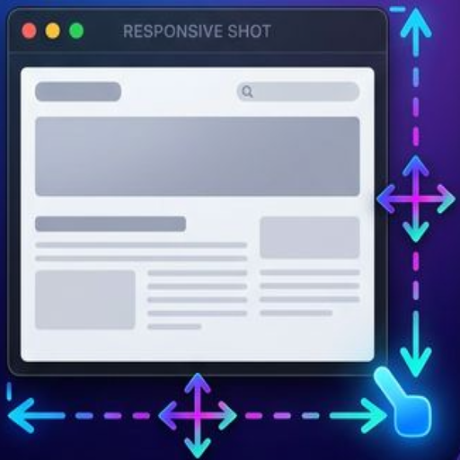

<a id="english"></a>

<p align="center">
  
</p>

<h1 align="center">ResponsiveShot</h1>

<p align="center">
  A macOS desktop app for capturing responsive screenshots in bulk.<br/>
  Built with <strong>Tauri v2</strong> + <strong>Vue 3</strong> + <strong>TypeScript</strong> + <strong>Rust</strong>.
</p>

<div align="center">
  <!-- License -->
  <a href="LICENSE">
    
  </a>
  <!-- Latest release -->
  <a href="https://github.com/annrie/ResponsiveShot/releases/latest">
    
  </a>
  <!-- Downloads total -->
  <a href="https://github.com/annrie/ResponsiveShot/releases">
    
  </a>
  <!-- Downloads latest release -->
  <a href="https://github.com/annrie/ResponsiveShot/releases/latest">
    
  </a>
  <!-- Stars -->
  <a href="https://github.com/annrie/ResponsiveShot/stargazers">
    
  </a>
</div>

<p align="center">
  <a href="#features">Features</a> · <a href="#device-frames">Device frames</a> · <a href="#requirements">Requirements</a> · <a href="#build">Build</a> · <a href="#日本語">日本語</a>
</p>

---

ResponsiveShot launches Chrome, opens a target URL, and saves screenshots for multiple viewport widths in one run.

## Features

- Capture multiple viewport widths in one run
- Capture modes:
  - Full page
  - Viewport
  - Selected element
- PNG screenshot output
- GIF recording output
- Device frames: capture at a real device's resolution and composite into official Apple / Google Pixel bezels, with optional drop shadow (PNG only)
- Optional manual interaction before capture
- Configurable capture delay
- Ratio-based viewport height for viewport captures
  - 16:9
  - 16:10
  - 4:3
  - 3:2
  - 1:1
  - 21:9
  - 9:16
  - Custom ratio
- macOS universal app build support
- 8 UI languages (ja / en / de / es / fr / ko / pt-BR / zh-TW); switch from the header

## Languages

The UI is available in Japanese, English, German, Spanish, French, Korean, Portuguese (Brazil) and Traditional Chinese. Switch languages from the select in the header. The language follows your saved choice (header selector), otherwise the system language, otherwise English. The manual-interaction overlay injected into Chrome also follows the app language. Messages returned by the capture engine (errors, import results) are always in English, regardless of the UI language. Translations other than Japanese and English are machine-assisted; corrections are welcome.

## Device frames

Select devices in the "Device frames" panel to capture the page at that device's CSS size and pixel ratio and save it composited into the device bezel (`capture_<device>_framed.png`, or `…_framed-shadow.png` with the drop-shadow toggle). Frames are applied to PNG output only.

- **Google Pixel** (Pixel 9 / 9 Pro / 9 Pro XL / 9a / 10 / 10 Pro / 10 Pro XL / 10a / Pixel Tablet) frames are bundled. They are derived from the Android Open Source Project (Apache License 2.0, see `src-tauri/frames/google/NOTICE`). Regenerate with `scripts/build-pixel-frames.sh` (requires ImageMagick).
- **Apple iPhone 16 family, iPhone 17 / iPhone Air / 17 Pro / 17 Pro Max, iPhone 18 Pro / Pro Max, iPhone Duo (inner and outer display, portrait and landscape), iPad Pro (M5) / iPad Air (M4) / iPad mini (A17 Pro) in portrait and landscape, MacBook Air / MacBook Pro (M5), iMac (M4), Studio Display (2026)** bezels are not bundled because Apple's license does not allow redistribution. Download the "Product Bezels" DMG from [Apple Design Resources](https://developer.apple.com/design/resources/#product-bezels) yourself and use "Import DMG / PNG" in the panel; the PNGs are copied to `~/Library/Application Support/com.responsiveshot.app/frames/`. Use them under Apple's [marketing guidelines](https://developer.apple.com/app-store/marketing/guidelines/) at your own responsibility (adding a shadow counts as a modification under those guidelines). If the DMG is already mounted in Finder, eject it first, or use "Import folder" and pick the mounted volume under /Volumes. Each device lists which DMG to download; one DMG import covers every model, color and orientation in it that the catalog supports (iPhone frames are registered in portrait only).
- **Background**: framed output is transparent by default; choose white, black or any `#rrggbb` in the panel to bake an opaque background (useful for viewers like Preview.app that render transparency as black).
- Optional "Emulate mobile UA / touch" toggle (off by default): captures with the device's user agent (iPhone Safari / Pixel Chrome) and touch events enabled. iPads keep the desktop UA (as real ones do) but get touch; Macs and displays are unaffected. UA Client Hints (`Sec-CH-UA`) are not overridden, so sites relying on them may still serve desktop layouts.

## Requirements

- macOS
- Node.js
- pnpm
- Rust
- Tauri prerequisites
- Chrome or Chromium available to `headless_chrome`

For universal macOS builds, both Rust targets are required:

```bash
rustup target add aarch64-apple-darwin
rustup target add x86_64-apple-darwin
```

## Setup

```bash
pnpm install
```

## Development

Run the frontend only:

```bash
pnpm run dev
```

Run the Tauri app in development mode:

```bash
pnpm run tauri:dev
```

## Build

Build the frontend:

```bash
pnpm run build
```

Build the Tauri app for the current architecture:

```bash
pnpm run tauri:build
```

Build a universal macOS `.app` bundle:

```bash
pnpm run tauri:build:universal
```

The universal app is generated under:

```text
src-tauri/target/universal-apple-darwin/release/bundle/macos/ResponsiveShot.app
```

## Notes

The universal build script currently bundles the macOS `.app` only. This avoids DMG packaging failures while still producing a universal binary.

You can verify the generated binary with:

```bash
lipo -archs src-tauri/target/universal-apple-darwin/release/bundle/macos/ResponsiveShot.app/Contents/MacOS/ResponsiveShot
```

Expected output:

```text
x86_64 arm64
```

The app is unsigned. On first launch, right-click → Open, or clear the quarantine flag:

```bash
xattr -dr com.apple.quarantine ResponsiveShot.app
```

---

<a id="日本語"></a>

<p align="center">
  
</p>

<h2 align="center">ResponsiveShot — 日本語ドキュメント</h2>

<p align="center">
  レスポンシブ確認用のスクリーンショットを一括で撮影する macOS デスクトップアプリ<br/>
  <strong>Tauri v2</strong> + <strong>Vue 3</strong> + <strong>TypeScript</strong> + <strong>Rust</strong> で構築
</p>

<p align="center">
  <a href="#主な機能">主な機能</a> · <a href="#デバイスフレーム">デバイスフレーム</a> · <a href="#必要なもの">必要なもの</a> · <a href="#ビルド">ビルド</a> · <a href="#english">English</a>
</p>

---

ResponsiveShot は Chrome を起動して指定した URL を開き、複数のビューポート幅のスクリーンショットを一度にまとめて保存します。

### 主な機能

- 複数のビューポート幅を 1 回の実行でまとめて撮影
- キャプチャモード:
  - ページ全体
  - ビューポート（ファーストビュー）
  - 選択した要素
- PNG スクリーンショット出力
- GIF 録画出力
- デバイスフレーム: 実機の解像度で撮影し、Apple / Google Pixel の公式ベゼルに合成（ドロップシャドウは任意、PNG のみ）
- 撮影前の手動操作（任意）
- 撮影前の待機時間を設定可能
- ビューポート撮影時の高さをアスペクト比から設定
  - 16:9
  - 16:10
  - 4:3
  - 3:2
  - 1:1
  - 21:9
  - 9:16
  - 任意の比率
- macOS ユニバーサルアプリのビルドに対応
- UI は 8 言語（ja / en / de / es / fr / ko / pt-BR / zh-TW）。ヘッダーで切替

### 対応言語

UI は日本語 / 英語 / ドイツ語 / スペイン語 / フランス語 / 韓国語 / ポルトガル語（ブラジル）/ 繁体字中国語に対応しています。ヘッダーのセレクトで言語を切り替えられます。言語はヘッダーで保存した選択 → システムの言語 → 英語 の順で決まります。Chrome に注入される手動操作オーバーレイもアプリの言語に追従します。キャプチャエンジンが返すメッセージ（エラー、取り込み結果）は UI の言語に関わらず常に英語です。日本語・英語以外の翻訳は機械翻訳ベースのため、修正歓迎です。

### デバイスフレーム

「デバイスフレーム」パネルで端末を選ぶと、その端末の CSS 寸法・ピクセル比で撮影し、ベゼルにはめ込んだ PNG（`capture_<device>_framed.png`、ドロップシャドウ ON なら `…_framed-shadow.png`）を保存します。フレームは PNG 出力のみに適用されます。

- **Google Pixel**（Pixel 9 / 9 Pro / 9 Pro XL / 9a / 10 / 10 Pro / 10 Pro XL / 10a / Pixel Tablet）のフレームは同梱しています。Android Open Source Project 由来（Apache License 2.0、`src-tauri/frames/google/NOTICE` 参照）。`scripts/build-pixel-frames.sh` で再生成できます（ImageMagick が必要）。
- **Apple iPhone 16 系、iPhone 17 / iPhone Air / 17 Pro / 17 Pro Max、iPhone 18 Pro / Pro Max、iPhone Duo（内側・外側画面の縦・横）、iPad Pro (M5) / iPad Air (M4) / iPad mini (A17 Pro) の縦・横、MacBook Air / MacBook Pro (M5)、iMac (M4)、Studio Display (2026)** のベゼルは Apple のライセンス上再配布できないため同梱していません。[Apple Design Resources](https://developer.apple.com/design/resources/#product-bezels) から「Product Bezels」の DMG をご自身でダウンロードし、パネルの「DMG / PNG を取り込む」で取り込んでください。PNG は `~/Library/Application Support/com.responsiveshot.app/frames/` にコピーされます。Apple の[マーケティングガイドライン](https://developer.apple.com/app-store/marketing/guidelines/)に従いご自身の責任で使用してください（影の追加はガイドライン上の改変に当たります）。DMG を Finder で既にマウントしている場合は取り出してから取り込むか、「フォルダを取り込む」で /Volumes 内のボリュームを選んでください。各機種の行にダウンロードする DMG が示されます。DMG を 1 つ取り込むと、その中でカタログが対応する機種・色・向きがまとめて取り込まれます（iPhone のフレームは縦のみ登録しています）。
- **背景**: フレーム付き出力は既定で透明です。パネルで 白 / 黒 / 任意の `#rrggbb` を選ぶと不透明な背景が焼き込まれます（透明を黒く表示するプレビュー.app などで確認する場合に便利です）。
- 「モバイル UA / タッチをエミュレート」トグル（既定 OFF）: 機種相応の UA（iPhone Safari / Pixel Chrome）とタッチイベントで撮影します。iPad は実機どおりデスクトップ UA のままタッチのみ有効。Mac・ディスプレイは対象外です。UA Client Hints（`Sec-CH-UA`）は上書きしないため、それで判定するサイトには効かないことがあります。

### 必要なもの

- macOS
- Node.js
- pnpm
- Rust
- Tauri の開発に必要なツール
- `headless_chrome` から起動できる Chrome または Chromium

ユニバーサルビルドには両方の Rust ターゲットが必要です:

```bash
rustup target add aarch64-apple-darwin
rustup target add x86_64-apple-darwin
```

### セットアップ

```bash
pnpm install
```

### 開発

フロントエンドのみを起動:

```bash
pnpm run dev
```

Tauri アプリを開発モードで起動:

```bash
pnpm run tauri:dev
```

### ビルド

フロントエンドのビルド:

```bash
pnpm run build
```

現在のアーキテクチャ向けに Tauri アプリをビルド:

```bash
pnpm run tauri:build
```

ユニバーサル macOS `.app` バンドルのビルド:

```bash
pnpm run tauri:build:universal
```

ユニバーサルアプリは次の場所に生成されます:

```text
src-tauri/target/universal-apple-darwin/release/bundle/macos/ResponsiveShot.app
```

### 補足

ユニバーサルビルドのスクリプトは現在 macOS の `.app` のみをバンドルします。DMG パッケージングの失敗を避けつつ、ユニバーサルバイナリを生成するためです。

生成されたバイナリは次のコマンドで確認できます:

```bash
lipo -archs src-tauri/target/universal-apple-darwin/release/bundle/macos/ResponsiveShot.app/Contents/MacOS/ResponsiveShot
```

期待される出力:

```text
x86_64 arm64
```

アプリは未署名です。初回起動時は、アプリを右クリックして「開く」を選ぶか、隔離属性を解除してください:

```bash
xattr -dr com.apple.quarantine ResponsiveShot.app
```
